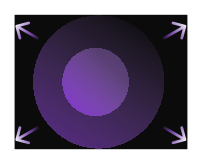
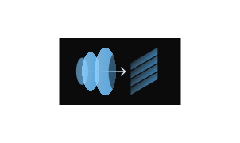
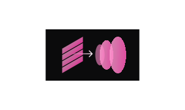
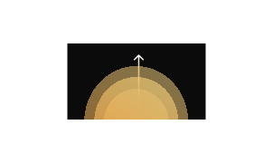

[Introducing Nova-3, our newest flagship Speech-to-Text model! →](/docs/models-languages-overview)

<h1>Welcome to Deepgram Docs!</h1>
Build your voice AI solutions with the best voice agent, speech-to-text, and text-to-speech APIs.

Enterprise grade APIs (cloud-hosted or self-hosted) with the highest accuracy, low latency, and lowest cost.

  

    <h3>Voice agent API</h3>
    

      Create agents for contact centers, teaching, drive thrus and more
    

    - [Getting started](/docs/voice-agent)
    - [Function calling](/docs/voice-agents-function-calling)
  

  

    
  

<CardGroup cols={3}>
    <Card>
      

        

        <h3>Speech to text API</h3>
        

          Transcribe audio for contact centers, medical audio, wearables and more
        

        - [Pre-recorded](/docs/pre-recorded-audio)
        - [Streaming](/docs/live-streaming-audio)
        - [Models and Languages](/docs/models-languages-overview)
      

    </Card>
    <Card>
      

        

      <h3>Text to speech API</h3>
      

         Generate audio for contact centers, IVRs, drive thrus and more
       

        - [Getting started](/docs/text-to-speech)
        - [Voices](/docs/tts-models)
      

    </Card>
    <Card>
      

        

      <h3>Intelligence API</h3>
      

        Gain insights for phone calls and transcripts
      

        - [Audio inputs](/docs/audio-intelligence)
        - [Text inputs](/docs/text-intelligence)
      

    </Card>   
</CardGroup>

## SDKs

<CardGroup cols={4}>
<Card
  title="Python"
  iconPosition="left"
  icon={}
  href="/docs/python-sdk"
/>
<Card
  title="JavaScript"
  iconPosition="left"
  icon={}
  href="/docs/js-sdk"
/>
<Card
  title="Go"
  iconPosition="left"
  icon={}
  href="/docs/go-sdk"
/>
<Card
  title=".Net"
  iconPosition="left"
  icon={}
  href="/docs/dotnet-sdk"
/>
</CardGroup>

## Resources

<CardGroup cols={3}>
<Card
  title="Explore"
  icon="rocket"
  iconPosition="left"
>

- [API Playground](https://playground.deepgram.com)
- [API Reference](/reference/deepgram-api-overview)

</Card>
<Card
  title="Self Host"
  icon="tools"
  iconPosition="left"
>

- [Get started with self-hosting](/docs/self-hosted-introduction)
- [Self-hosted add-ons](/docs/self-hosted-add-ons)

</Card>
<Card
  title="Community"
  icon="users"
  iconPosition="left"
>

- [Discord](https://dpgr.am/discord)
- [Discussion Forums](https://github.com/orgs/deepgram/discussions)

</Card>
</CardGroup>

