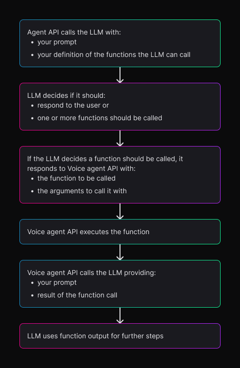
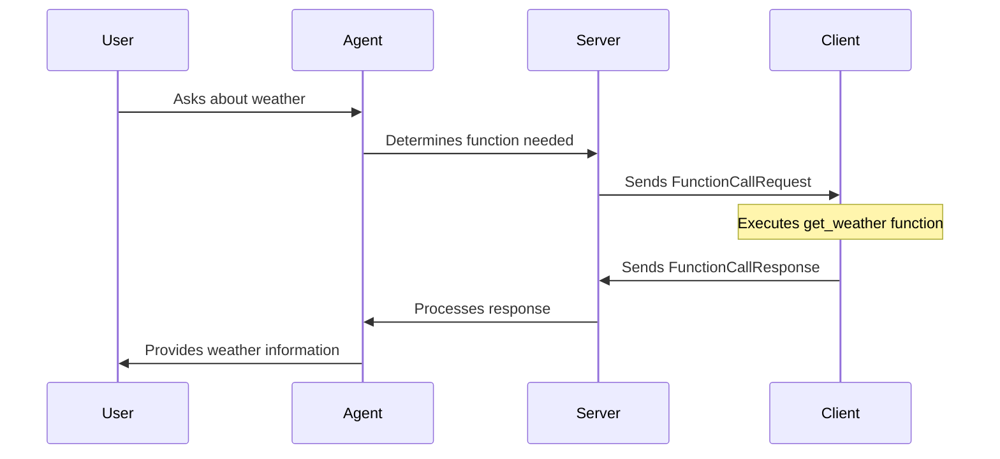

<Markdown src="../snippets/voice-agent.mdx" />

# What is Function Calling?

Function calling is the ability of large language models (LLMs) to invoke external functions or APIs in response to user queries. For example, if a user asks for the current weather in a specific location, the LLM can use function calling to call a weather API, fetch real-time data, and present it in a structured response.

This capability allows LLMs to enhance their functionality by integrating with other systems, services, or databases to provide real-time data, perform specific tasks, or trigger actions.

## How Function Calling Works

* **User Query**: A user asks the LLM something that requires external data or specific action (e.g., "Check the weather in New York" or "Book an appointment").
* **Function Identification:** The LLM identifies that the query requires a specific function to be called. For instance, if the user asks for the weather, the model recognizes that it needs to call a weather API rather than generate a general response.
* **Parameter Extraction:** The LLM analyzes the user's query to extract the required parameters (e.g., location, date, or other variables). For example, in the weather query, "New York" would be extracted as the location parameter.
* **Call the Function:** The LLM triggers an external function or API with the appropriate parameters. This could involve fetching live data, performing a task (e.g., making a booking), or retrieving information that is outside the LLM's static knowledge.
* **Return the Result:** The function returns the result (such as the current weather data), which the LLM incorporates into its response back to the user.



## Configuring Function Calling

Below is an example of the `Settings` message with the `agent.think` configuration object that includes function calling capabilities. To see a complete example of the `Settings` message, see the [Configure the Voice Agent](/docs/configure-voice-agent) documentation.

<CodeGroup>
  ```json JSON
  {
    "type": "Settings",
    ...// other settings fields
    "agent": {
        "think": {
        "provider": {
          "type": "open_ai",
          "model": "gpt-4",
          "temperature": 0.7
        },
        "endpoint": { // Optional for non-Deepgram LLM providers. When present, must include url field and headers object
          "url": "https://api.example.com/llm",
          "headers": {
            "authorization": "Bearer {{token}}"
          }
        },
        "prompt": "You are a helpful AI assistant focused on customer service.",
        "functions": [
          {
            "name": "check_order_status",
            "description": "Check the status of a customer order",
            "parameters": {
              "type": "object",
              "properties": {
                "order_id": {
                  "type": "string",
                  "description": "The order ID to check"
                }
              },
              "required": ["order_id"]
            },
            "endpoint": { // If not provided, function is called client-side
              "url": "https://api.example.com/orders/status",
              "method": "post",
              "headers": {
                "authorization": "Bearer {{token}}"
              }
            }
          }
        ]
      }
    }
  }
  ```
</CodeGroup>

## Client-Side Function Calling
If your function will run client-side and you do not need to make a request to a server, you will not need to use the endpoint object and do not need to provide the `url`, `headers`, or `method` fields.

<CodeGroup>
  ```json JSON
{
  "type": "Settings",
  ...// other settings fields
  "agent": {
      "prompt": "You are a helpful AI assistant that can provide weather information.",
      "functions": [
        {
          "name": "get_weather",
          "description": "Get the current weather for a specific location",
          "parameters": {
            "type": "object",
            "properties": {
              "location": {
                "type": "string",
                "description": "The city or location to get weather for"
              }
            },
            "required": ["location"]
          }
        }
      ]
    }
  }
}
...// other settings fields
  ```
</CodeGroup>

In this example code below, the `get_weather` function gets triggered when someone asks the Agent about the weather in a particular place.

<CodeGroup>
  ```javascript JavaScript
  export const getWeather = async (location: string): Promise<string | null> => {
    const apiKey = import.meta.env.VITE_OPENWEATHER_API_KEY;

    try {
      const response = await fetch(
        `https://api.openweathermap.org/data/2.5/weather?q=${location}&appid=${apiKey}`
      );

      if (!response.ok) {
        throw new Error('Failed to fetch weather data');
      }

      const data = await response.json();

      return `The current weather in ${data.name} is ${data.weather[0].description} with a temperature of ${data.main.temp}°K.`;
    } catch (err) {
      console.error(err);
      return null;
    }
  };
  ```
  ```python Python
import os
import requests
from typing import Optional

def get_weather(location: str) -> Optional[str]:
    api_key = os.getenv("OPENWEATHER_API_KEY")

    try:
        response = requests.get(
            f"https://api.openweathermap.org/data/2.5/weather",
            params={"q": location, "appid": api_key}
        )
        response.raise_for_status()

        data = response.json()
        return f"The current weather in {data['name']} is {data['weather'][0]['description']} with a temperature of {data['main']['temp']}°K."
    except Exception as err:
        print(f"Error: {err}")
        return None
  ```
  ```CSharp C#
  using System;
using System.Net.Http;
using System.Text.Json;
using System.Threading.Tasks;

public class WeatherService
{
    private readonly HttpClient _httpClient;

    public WeatherService(HttpClient httpClient)
    {
        _httpClient = httpClient;
    }

    public async Task<string?> GetWeather(string location)
    {
        var apiKey = Environment.GetEnvironmentVariable("OPENWEATHER_API_KEY");

        try
        {
            var response = await _httpClient.GetAsync(
                $"https://api.openweathermap.org/data/2.5/weather?q={location}&appid={apiKey}"
            );

            response.EnsureSuccessStatusCode();

            var data = await JsonSerializer.DeserializeAsync<WeatherResponse>(
                await response.Content.ReadAsStreamAsync()
            );

            return $"The current weather in {data?.Name} is {data?.Weather[0].Description} with a temperature of {data?.Main.Temp}°K.";
        }
        catch (Exception ex)
        {
            Console.Error.WriteLine($"Error: {ex.Message}");
            return null;
        }
    }
}

public class WeatherResponse
{
    public string Name { get; set; }
    public Weather[] Weather { get; set; }
    public Main Main { get; set; }
}

public class Weather
{
    public string Description { get; set; }
}

public class Main
{
    public float Temp { get; set; }
}
  ```
  ```Go Go
 package main

import (
    "encoding/json"
    "fmt"
    "net/http"
    "os"
)

type WeatherResponse struct {
    Name string `json:"name"`
    Weather []struct {
        Description string `json:"description"`
    } `json:"weather"`
    Main struct {
        Temp float64 `json:"temp"`
    } `json:"main"`
}

func getWeather(location string) (string, error) {
    apiKey := os.Getenv("OPENWEATHER_API_KEY")

    url := fmt.Sprintf("https://api.openweathermap.org/data/2.5/weather?q=%s&appid=%s", location, apiKey)
    resp, err := http.Get(url)
    if err != nil {
        return "", fmt.Errorf("failed to fetch weather data: %v", err)
    }
    defer resp.Body.Close()

    if resp.StatusCode != http.StatusOK {
        return "", fmt.Errorf("failed to fetch weather data: status code %d", resp.StatusCode)
    }

    var data WeatherResponse
    if err := json.NewDecoder(resp.Body).Decode(&data); err != nil {
        return "", fmt.Errorf("failed to decode response: %v", err)
    }

    return fmt.Sprintf("The current weather in %s is %s with a temperature of %.2f°K.",
        data.Name, data.Weather[0].Description, data.Main.Temp), nil
}
  ```

</CodeGroup>

# Function Calling Message Flow

2 types of Function calling messages are exchanged between the client and Deepgram's Voice Agent API server through a websocket.

A [`FunctionCallRequest`](/docs/voice-agent-function-call-request) message is used to initiate function calls in your Voice Agent. This message can trigger either a server-side function execution or request a client-side function execution, depending on the client_side property setting.

A [`FunctionCallResponse`](/docs/voice-agent-function-call-response)can be sent by the client or server. When sent from the client it is a response to a function call, but when sent from the server it is information about a function call that was requested by the agent.

Below is an example of a function call message flow based on the `get_weather` function example above.

1. User submits a query → The agent determines a function is needed.
2. Server sends a `FunctionCallRequest` → Requests function execution.
3. Client executes the function and sends a `FunctionCallResponse` → Returns the function result.
4. Server uses the response.
5. The agent continues the conversation.



***
